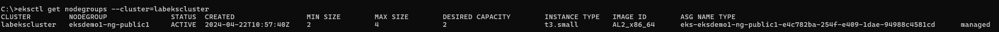
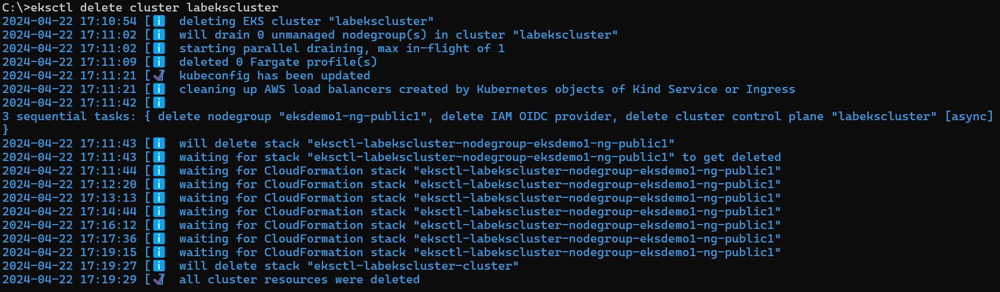

# Delete Amazon EKS Cluster & Node Groups using CLI

## Step-01: Fetch EKS cluster details

```
# Get the EKS Cluster list
eksctl get clusters

# Get the EKS cluster's node group list
eksctl get nodegroups --cluster=<eks_cluster_name>
```



## Step-02: Delete EKS Worker nodes

```
# Delete the EKS cluster's node group

eksctl delete nodegroup --cluster=<eks_cluster_name> --name=<eks_cluster_node_group>
```

## Step-03: Delete EKS Cluster

```
# Delete the EKS cluster
eksctl delete cluster <eks_cluster_name>
```


