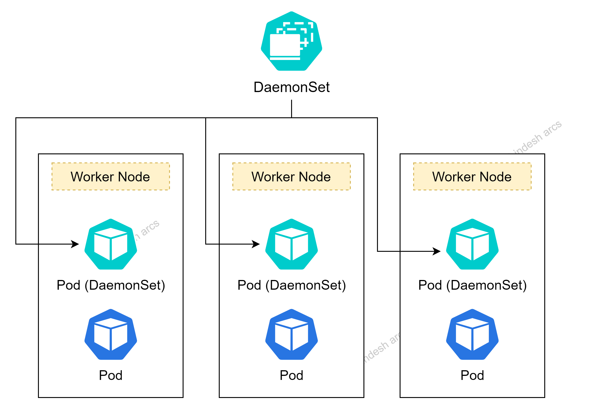

# Kubernetes DaemonSets

## How DaemonSet works?

- ReplicaSets and Deployments help us ensure that multiple copies of our applications are up and running across various worker nodes.
- **DaemonSets** create a mutiple copies of a pod, meanwhile making sure that at least one copy of the pod is evenly on each node in the Kubernetes cluster.
- If a new node is added to the cluster, a replica of that pod is automatically assigned to that node.
- Similarly, when a node is removed, the pod is automatically removed.



## Working with DaemonSets

### Step-01: Create a DaemonSet

- Create a k8s manifest for daemonSet, say _fluentd-daemonset.yaml_.
- I've intentionally created this manifest to create a daemonset in _kube-system_ namespace.

```
apiVersion: apps/v1
kind: DaemonSet
metadata:
  name: fluentd-ds
  namespace: kube-system
  labels:
    k8s-app: fluentd
spec:
  selector:
    matchLabels:
      name: fluentd
  template:
    metadata:
      labels:
        name: fluentd
  spec:
    containers:
      - name: fluentd
        image: fluentd:latest
```

### Step-02: List all the DaemonSets

```
# List DaemonSets
kubectl get daemonsets

# DaemonSet alias is "ds"
kubectl get ds

# List daemonsets belongs to a particular namespace, say kube-system
kubectl get ds -n kube-system
```

### Step-03: Describe a DaemonSet

```
kubectl describe daemonsets fluentd-ds -n kube-system

OR

kubectl describe ds/fluentd-ds -n kube-system
```

### Step-04: Delete a DaemonSet

```
# Delete a DaemonSet
kubectl delete ds fluentd-ds -n kube-system

```
