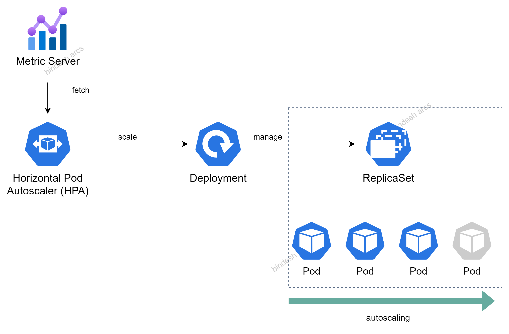

# Kubernetes `HorizontalPodAutoscaler` (HPA)

- To update a workload resource such as a _Deployment_ or a _StatefulSet_, we can also use HPA.
- HPA is a Kubernetes API primitive that scales the workloads automatically based on the demand.



## How HPA works?

- HPA is configured to fetch metrics provided by a metrics server based on the CPU and memory usage.
- These metrics are fetched from kubelet by the metrics server, which then exposes them to the API server using a metrics API.
- HPA scales the Deployment by increasing or decreasing the count of replicas, which is managed underneath by a ReplicaSet.

### 01. Create a HPA (imperative way)

- The following command will create a HPA with a CPU utilization usage of 50% and ensure a minimum of 3 replicas and a maximum of up to 10 replicas:

```
kubectl autoscale deployment kubeserve --cpu-percent=50 --min=3 --max=10

# "cpu-percent" indicates the average CPU utilization usage across all pods
# "min" provides the minimum number of replicas
# "max" provides the maximum number of replicas


# List all the HPAs
kubectl get hpa
```

### 02. Create a HPA (declarative way)

- Create a HPA manifest, say _deployment-hpa.yaml_

```
apiVersion: autoscaling/v2
kind: HorizontalPodAutoscaler
metadata:
  name: kubeserve
spec:
  scaleTargetRef:
    apiVersion: apps/v1
    kind: Deployment
    name: nginx-deployment
  minReplicas: 3
  maxReplicas: 10
  metrics:
    - type: Resource
  resource:
    name: cpu
    target:
      type: Utilization
      averageUtilization: 50
```

- Deploy the hpa manifest to create a HPA for a Deployment

```
kubectl apply -f deployment-hpa.yaml
```

### 03. Delete a HPA

```
kubectl delete hpa <deployment_name>
```
